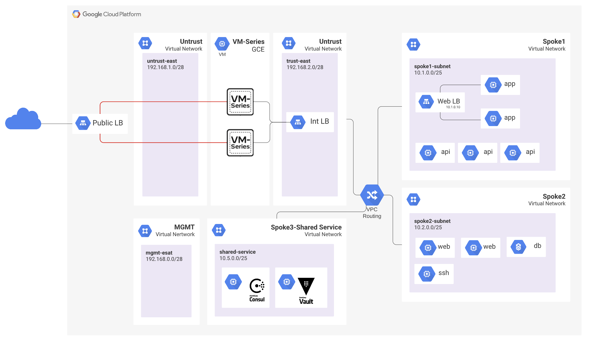

# Consul Network Infrastructure Automation with Palo Alto

## Overview

 In this build, you will deploy a common set of PAN-OS VM-Series firewalls to to build a secure Google Cloud hub and spoke network
 * internet inbound
 * internet outbound
 * east-west traffic 
 The build shows how traffic flows through the VM-Series firewalls and load balancers.

**Important Information**

* Do not use this build for any production environments.  The build should only be used for learning and/or for proof-of-concept scenarios.
* The example.tfvars sets the VM-Series license to pay-as-you-go bundle2.  This means there is an additional charge on top of the compute running cost.  Please see <a href="https://docs.paloaltonetworks.com/vm-series/10-2/vm-series-deployment/license-the-vm-series-firewall/vm-series-firewall-licensing">VM-Series licensing</a> for more information.

## Objectives 

* Review the VM-Series hub-and-spoke architecture using VPC network peering. 
* Build the environment using Terraform.
* Deploy Consul Terraform Sync 
* Deploy an event-driven architecture that automatically updates address-groups on a PAN device.
* Validate Consul Terraform Sync by making changes to the app,api,web and watch Consul Terraform Sync automatically updates the PAN Address groups.
* Validate and visualize internet inbound, internet outbound, and east-west (VPC to VPC) traffic through Google Cloud load balancers and the VM-Series firewalls.


## Topology
Below is the network topology of the build. Everything in the diagram is built with Terraform, including the local configuration of the compute resources. All traffic to/from the spoke VPC networks flows through the VM-Series firewalls for inspection. The VM-Series network interfaces are attached to the management, untrust, and trust networks. All cloud workloads that are protected by the VM-Series are deployed in the spoke networks which are VPC peers with the trust network.

<p align="center">
    
</p>


## Prerequists

1. GCP Account 
2. Install gcloud CLI
3. Create a new GCP Project 
4. Enable Compute API 
5. Create a service account

## Part 1 - Deploy Infrastructure

note: it takes about 10 min for PAN to spin up.. so wait until you access it before you continue to deploy the apps

1. Open Google cloud shell.
2. In cloud shell, copy and paste the following to enable the required APIs, create an SSH key, and to clone the Github repository.

```
gcloud services enable compute.googleapis.com
ssh-keygen -f ~/.ssh/gcp-consuldemo -t rsa -C gcp-consuldemo
git clone https://github.com/maniak-academy/gcp-terraform-consul-nia.git
cd gcp-terraform-consul-nia/01-infra/
```

If you are using a SSH key that is not ~/.ssh/gcp-consuldemo, you must modify the public_key_path value in the terraform.tfvars file.

3. Initialize and apply the Terraform plan.

```
terraform init
terraform apply 
```

4. Verify the apply output. Enter ```yes``` to start the build.

When the build completes, the following output will be generated.

```

Apply complete! Resources: 66 added, 0 changed, 0 destroyed.

Outputs:

ext_lb_url = "http://34.121.197.90"
google_compute_zones = "us-central1-a"
project_id = "tf-gcp-373822"
region = "us-central1"
spoke_vm_image = "https://www.googleapis.com/compute/v1/projects/panw-gcp-team-testing/global/images/ubuntu-2004-lts-apache"
spoke_vm_scopes = tolist([
  "https://www.googleapis.com/auth/cloud.useraccounts.readonly",
  "https://www.googleapis.com/auth/devstorage.read_only",
  "https://www.googleapis.com/auth/logging.write",
  "https://www.googleapis.com/auth/monitoring.write",
])
spoke_vm_type = "f1-micro"
spoke_vm_type2 = "n1-standard-2"
spoke_vm_user = "paloalto"
ss_subnets_self_links0 = "https://www.googleapis.com/compute/v1/projects/tf-gcp-interview-373822/regions/us-central1/subnetworks/us-central1-ss"
ssh_to_spoke2 = "ssh paloalto@35.184.33.200"
vmseries01_access = "34.171.48.108"
vpc_spoke1_network_id = "projects/tf-gcp-interview-373822/global/networks/spoke1-vpc"
```

** note: it takes about 10 min for PAN to spin up.. so wait until you access it before you continue to deploy the apps **

Username: paloalto
Password: Pal0Alt0@123


## Part 2 - Deploy Infrastructure
** note: it takes about 10 min for PAN to spin up.. so wait until you access it before you continue to deploy the apps **

Since we are deploying the PAN as our Security Hub/Gateway it needs to be fully online before we start the next phase or the apps won't be able to get access to the internet and download the required code/repositories. 

1. Verify you can log into the GUI of the Palo Alto Device https://vmseries01_access
2. Log into the 02-infra folder
3. Initialize and apply the Terraform plan.

```
terraform init
terraform apply 
```

4. Verify the apply output. Enter ```yes``` to start the build.
5. When the build completes, it will output the http://consul:8200 GUI
6. Log into the consul server and wait for the following services to be online (consul, consul-terraform-sync, api, web, ssh, app)
7. Log into the Pan Firewall and verify that the following address groups have 1 IP in them (cts-add-grp-web,cts-add-grp-api, cts-add-grp-ssh and cts-add-grp-app)

The following consul-terraform-sync module automatically updated the pan-address-groups based on the health and availability of the service. So as services spin up and down, and if they registerd to Consul catalog. Consul-Terraform-Sync will automatically make updates to the pan to reflect what the source of truth is in the Consul catalog. 


## Part 3 - See Consul-Terraform-Sync in Action
Now that you have seen a little bit of magic, the next step is to scale the app,api and web and see the potential of an event-driven architecture with consul terraform sync.

1. Edit the terraform.tfvars and update the desired count of the following services

```
web_count        = "1"
app_count        = "1"
api_count        = "1"
```

2. Save the file 
3. Initialize and apply the Terraform plan.

```
terraform init
terraform apply 
```

4. Verify the apply output. Enter ```yes``` to start the build.
5. Once you see the new service spin up they will register to Consul
6. Once the service health check goes Green, consul terraform sync will automatically update the PAN Address-groups with the new IPs

Note: feel free to add and remove and see the entire thing in action.